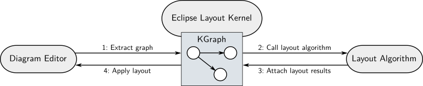

The *Eclipse Layout Kernel (ELK)* implements an infrastructure to connect diagram editors or viewers to automatic layout algorithms.  It also implements a number of standard layout algorithms ready to be used out of the box.

# Documentation for...

1. [...tool developers.](20_Tool-Developers)
    
    You want to add automatic layout capabilities to the editor / viewer you're developing.

1. [...algorithm developers.](30_Algorithm-Developers)
    
    You want to implement your own layout algorithms. Make sure you're already familiar with the documentation for tool developers before starting to read this, especially with our [graph data structure](20_10_Graph-Data-Structure).

1. [...ELK contributors.](40_ELK-Contributors)
    
    You want to contribute to the ELK code.

# Links of Interest

* [Project homepage](http://www.eclipse.org/elk)
* [Project forum / newsgroup](https://www.eclipse.org/forums/index.php?t=thread&frm_id=321)
* [Build server](https://hudson.eclipse.org/elk/)
* [Eclipse project metadata site](https://projects.eclipse.org/projects/modeling.elk)
