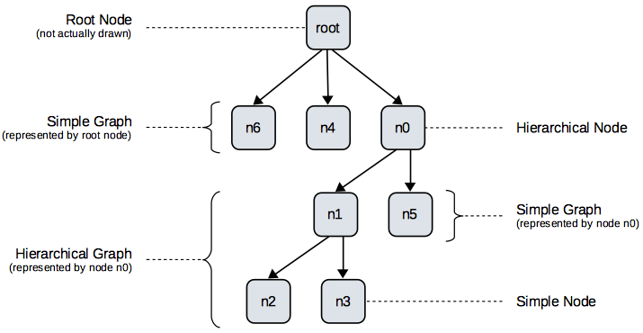

To represent graphs that should be laid out, the Eclipse Layout Kernel provides a robust EMF-based data structure. This page is about describing that graph data structure. Please note that the graph data structure is scheduled to be changed soon. Once that change is complete, we will provide more documentation here. Until that time, however, please refer [to our old documentation](http://rtsys.informatik.uni-kiel.de/confluence/x/U4EN). What we do have here already is a list of terms.

# Terminology

## Graphs

This is a simple example graph along with the terminology that goes with it.

## Inclusion Trees

Inclusion trees capture the hierarchical structure of a graph. See below for the inclusion tree of the graph we just saw, along with the terminology that goes with it.

## Definitions

* **Inclusion Tree:** The parent-child relationships of all nodes. This is basically the node containments in the EMF data structure. Note that in an ELK graph, the tree always has a single root node that represents the drawing area. Top-level nodes are children of that root node.

* **Graph:** A set of nodes and edges and whatever else belongs to them (labels, ports, ...).

    * *Simple Graph:* All children of a single node. The node represents that simple graph. This means that if the objects that the graph consists of are to be passed to a layout algorithm, this is done by simply passing the node object that represents that graph.

    * *Hierarchical Graph:* All descendants of a single node. Although the word "all" is a bit too strong here: we may choose to exclude all descendants of one of the node's descendants. Similar to simple graphs, that single node represents the hierarchical graph. The root node represents the whole graph (see below) and is simply a special case of this rule.

* **Node:**

    * *Simple Node:* A node that does not contain child nodes.

    * *Hierarchical Node:* A node that contains child nodes.

* **Edge:**

    * *Simple Edge:* An edge that connects two nodes in the same simple graph. This of course implies that the edge's source and target nodes both have the same parent node.

    * *Hierarchical Edge:* An edge that is not simple.

        * *Short Hierarchical Edge:* A hierarchical edge that only has to leave (or enter) a single hierarchical node to get to its target. Thus, a short hierarchical edge connects nodes in adjacent layers of hierarchy.

        * *Long Hierarchical Edge:* A hierarchical edge that is not a short hierarchical edge.

* **Port:** An explicit connection point on a node for edges to connect to.

    * *Simple Port:* A port on a simple node, or a port that does not have incident hierarchical edges.

    * *Hierarchical Port:* A port on a hierarchical node that has incident hierarchical edges.

* **Root Node:** The root of the inclusion tree.

    * *Root Node of a Graph:* The lowest common ancestor of all nodes in the graph.
    

# Graph Data Structure

## The Meta Model

TODO Describe

## Programming With the Graph Data Structure

TODO Describe
