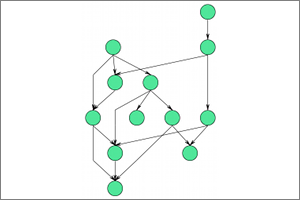

## Draw2D Layout

**Identifier:** org.eclipse.elk.conn.gmf.layouter.Draw2D
**Meta Data Provider:** GmfMetaDataProvider

### Description

'Directed Graph Layout' provided by the Draw2D framework. This is the same algorithm that is used by the standard layout button of GMF diagrams.

## Category: Layered

The layer-based method was introduced by Sugiyama, Tagawa and Toda in 1981. It emphasizes the direction of edges by pointing as many edges as possible into the same direction. The nodes are arranged in layers, which are sometimes called "hierarchies", and then reordered such that the number of edge crossings is minimized. Afterwards, concrete coordinates are computed for the nodes and edge bend points.

## Supported Graph Features

Name | Description
----|----
Multi Edges | Multiple edges with the same source and target node.

## Supported Options

Option | Type | Default Value | Identifier
----|----|----|----
[Direction](org-eclipse-elk-direction) | `Direction` | `Direction.RIGHT` | org&#8203;.eclipse&#8203;.elk&#8203;.direction
[Node Size Constraints](org-eclipse-elk-nodeSize-constraints) | `EnumSet<SizeConstraint>` | `EnumSet.noneOf(SizeConstraint)` | org&#8203;.eclipse&#8203;.elk&#8203;.nodeSize&#8203;.constraints
[Node Spacing](org-eclipse-elk-spacing-nodeNode) | `double` | `16` | org&#8203;.eclipse&#8203;.elk&#8203;.spacing&#8203;.nodeNode
[Padding](org-eclipse-elk-padding) | `ElkPadding` | `new ElkPadding(16)` | org&#8203;.eclipse&#8203;.elk&#8203;.padding

