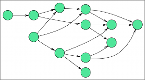

## Dot

**Identifier:** org.eclipse.elk.graphviz.dot
**Meta Data Provider:** layouter.GraphvizMetaDataProvider

### Description

Layered drawings of directed graphs. The algorithm aims edges in the same direction (top to bottom, or left to right) and then attempts to avoid edge crossings and reduce edge length. Edges are routed as spline curves and are thus drawn very smoothly. This algorithm is very suitable for state machine and activity diagrams, where the direction of edges has an important role.

## Category: Layered

The layer-based method was introduced by Sugiyama, Tagawa and Toda in 1981. It emphasizes the direction of edges by pointing as many edges as possible into the same direction. The nodes are arranged in layers, which are sometimes called "hierarchies", and then reordered such that the number of edge crossings is minimized. Afterwards, concrete coordinates are computed for the nodes and edge bend points.

## Supported Graph Features

Name | Description
----|----
Self Loops | Edges connecting a node with itself.
Multi Edges | Multiple edges with the same source and target node.
Edge Labels | Labels that are associated with edges.
Compound | Edges that connect nodes from different hierarchy levelsand are incident to compound nodes.
Clusters | Edges that connect nodes from different clusters, but not the cluster parent nodes.

## Supported Options

Option | Type | Default Value | Identifier
----|----|----|----
[Adapt Port Positions](org-eclipse-elk-graphviz-adaptPortPositions) | `boolean` | `true` | org&#8203;.eclipse&#8203;.elk&#8203;.graphviz&#8203;.adaptPortPositions
[Concentrate Edges](org-eclipse-elk-graphviz-concentrate) | `boolean` | `false` | org&#8203;.eclipse&#8203;.elk&#8203;.graphviz&#8203;.concentrate
[Debug Mode](org-eclipse-elk-debugMode) | `boolean` | `false` | org&#8203;.eclipse&#8203;.elk&#8203;.debugMode
[Direction](org-eclipse-elk-direction) | `Direction` | `Direction.DOWN` | org&#8203;.eclipse&#8203;.elk&#8203;.direction
[Edge Label Spacing](org-eclipse-elk-spacing-edgeLabel) | `double` | `5` | org&#8203;.eclipse&#8203;.elk&#8203;.spacing&#8203;.edgeLabel
[Edge Routing](org-eclipse-elk-edgeRouting) | `EdgeRouting` | `EdgeRouting.SPLINES` | org&#8203;.eclipse&#8203;.elk&#8203;.edgeRouting
[Hierarchy Handling](org-eclipse-elk-hierarchyHandling(org.eclipse.elk.graphviz.dot)) | `HierarchyHandling` | `HierarchyHandling.INHERIT` | org&#8203;.eclipse&#8203;.elk&#8203;.hierarchyHandling
[Iterations Factor](org-eclipse-elk-graphviz-iterationsFactor) | `double` | `1` | org&#8203;.eclipse&#8203;.elk&#8203;.graphviz&#8203;.iterationsFactor
[Label Angle](org-eclipse-elk-graphviz-labelAngle) | `double` | `-25` | org&#8203;.eclipse&#8203;.elk&#8203;.graphviz&#8203;.labelAngle
[Label Distance](org-eclipse-elk-graphviz-labelDistance) | `double` | `1` | org&#8203;.eclipse&#8203;.elk&#8203;.graphviz&#8203;.labelDistance
[Layer Spacing Factor](org-eclipse-elk-graphviz-layerSpacingFactor) | `double` | `1` | org&#8203;.eclipse&#8203;.elk&#8203;.graphviz&#8203;.layerSpacingFactor
[Node Size Constraints](org-eclipse-elk-nodeSize-constraints) | `EnumSet<SizeConstraint>` | `EnumSet.noneOf(SizeConstraint)` | org&#8203;.eclipse&#8203;.elk&#8203;.nodeSize&#8203;.constraints
[Node Size Options](org-eclipse-elk-nodeSize-options) | `EnumSet<SizeOptions>` | `EnumSet.of(SizeOptions.DEFAULT_MINIMUM_SIZE)` | org&#8203;.eclipse&#8203;.elk&#8203;.nodeSize&#8203;.options
[Node Spacing](org-eclipse-elk-spacing-nodeNode) | `double` | `20` | org&#8203;.eclipse&#8203;.elk&#8203;.spacing&#8203;.nodeNode
[Padding](org-eclipse-elk-padding) | `ElkPadding` | `new ElkPadding(10)` | org&#8203;.eclipse&#8203;.elk&#8203;.padding

