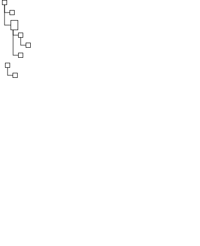

This algorithm takes a directed forest (a graph whose every component is a tree) and generates from it a layout reminiscient of the traditional representations of file systems.
I.e. the root of a tree is placed at the top left corner, and each node afterwards is placed in its own row, indented according to its position in the hierarchy. 
If the graph has several components, the next tree is again placed on the first level, below the preceding tree.
Children of the same parent node (in the graph theory sense, not as in nodes contained by other nodes) are placed below one another, indented at least as much as the parent. 
This algorithm allows the user to set three main parameters: 
- horizontal Edge Indentation, which decides how far the outgoing edges of a parent (by design exiting that parent at the bottom) should be offset compared to the parent's left edge
- relative Indentation, which decides how far a should should be indented horizontally relative to the position of its incoming edge. 
- vertical Node Spacing, which determines the vertical distance between a node and its immediate successor, independent of hierarchy.
The horizontal Edge Intentation of its parent and the relative Indentation add up to give the total indentation of a node.
